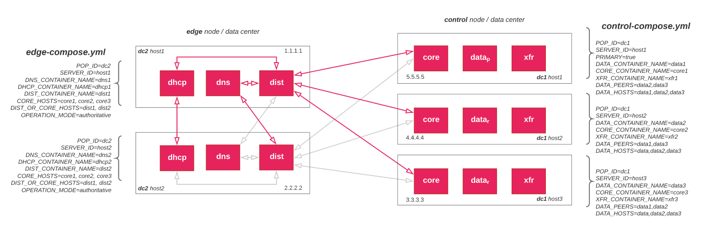

# Docker Compose for NS1 Private DNS / Enterprise DDI

These files provide example Docker Compose files for starting and configuring Private DNS or Enterprise DDI container images.

## Requirements

- Docker Version 17.03.x (CE or EE) or higher: https://docs.docker.com/engine/installation/
- Docker Compose Version 1.18.x or higher: https://docs.docker.com/compose/install/.

---

## docker-compose.yml

Use to start all container images on a single host: `data`, `dns`, `core`, `xfr`, `dhcp`, and `dist`. Useful for spinning up everything locally to get familiar with the system.

**IMPORTANT NOTE**: It is not advisable to use this file in production.

#### Variables:

- `TAG`: The image tag, or version number, of the container images; defaults to `2.1.0`
- `POP_ID`: Specifies the location (datacenter/pop) of the server where the data container is running; defaults to `mypop`
- `SERVER_ID`: Identifies a specific server in a location where the data container is running; defaults to `myserver`
- `DATA_PEERS`: Identifies the peer(s) of this host's data container with one operating as primary and the other replica; defaults to null
- `DATA_HOSTS`: Series of comma delimited hostnames of data containers e.g. data1,data2; defaults to `data`
- `DATA_CONTAINER_NAME`: Sets the container's name; defaults to `data`
- `DATA_SHARED_MEM`: Sets the containers shared memory value; defaults to `2gb`. This should be set to at least 25% of the host RAM.
- `CORE_CONTAINER_NAME`: Sets the container's name; defaults to `core`
- `XFR_CONTAINER_NAME`: Sets the container's name; defaults to `xfr`
- `API_FQDN`: FQDN for the api and feed URLs; defaults to `api.mycompany.net`
- `PORTAL_FQDN`: FQDN for the portal; defaults to `portal.mycompany.net`
- `NAMESERVERS`: Nameservers used in SOA records; defaults to `ns1.mycompany.net`
- `HOSTMASTER_EMAIL`: Hostmaster email address for SOA records; defaults to `hostmaster@mycompany.net`
- `DNS_CONTAINER_NAME`: Sets the container's name; defaults to `dns`
- `DHCP_CONTAINER_NAME`: Sets the container's name; defaults to `dhcp`
- `DIST_CONTAINER_NAME`: Sets the container's name; defaults to `dist`
- `CORE_HOSTS`: Series of comma delimited hostnames of `core` containers; specifies upstream `core` containers; defaults to `core`
- `DIST_HOSTS`: Series of comma delimited hostnames of distribution containers e.g. dist1,dist2; defaults to `dist`
- `OPERATION_MODE`: `authoritative`/`recursive`; the mode of operation for this `dns` container; defaults to `authoritative`

#### For example:

```shell
$sudo TAG=2.1.0 POP_ID=mypop SERVER_ID=myserver docker-compose -p myproject -f docker-compose.yml up -d
```

---


# Resources for Control and Edge Hosts
Production and production-like deployment toplogies generally follow a "hub and spoke" pattern where certain services can be grouped in the "hub" referred to here as `control node`; other services on the "spoke", which we referred to as `edge node`.


**Figure 1**. Example topology with `control-compose.yml` and `edge-compose.yml` command line variables for reference.


## control-compose.yml

Used to start control services on a single host: `data`, `core`, `xfr`.

#### Variables:

- `TAG`: The image tag, or version number, of the container images; defaults to `2.1.0`
- `PRIMARY`: Skip if the host's `data` container will operate as a Replica or set this variable to `true` if the host's `data` container will operate as Primary in a Primary-Replica configuration; commented out by default
- `POP_ID`: Specifies the location (datacenter/pop) of the server where the data container is running; defaults to `mypop`
- `SERVER_ID`: Identifies a specific server in a location where the data container is running; defaults to `myserver`
- `DATA_PEERS`: Identifies the peer(s) of this host's data container with one operating as primary and the other replica; defaults to null
- `DATA_HOSTS`: Series of comma delimited hostnames of data containers e.g. data1,data2; defaults to `data`
- `DATA_CONTAINER_NAME`: Sets the container's name; defaults to `data`
- `DATA_SHARED_MEM`: Sets the containers shared memory value; defaults to `2gb`. This should be set to at least 25% of the host RAM.
- `CORE_CONTAINER_NAME`: Sets the container's name; defaults to `core`
- `XFR_CONTAINER_NAME`: Sets the container's name; defaults to `xfr`
- `CORE_HOSTS`: Series of comma delimited hostnames of `core` containers; specifies upstream `core` containers; defaults to `core`
- `API_FQDN`: FQDN for the api and feed URLs; defaults to `api.mycompany.net`
- `PORTAL_FQDN`: FQDN for the portal; defaults to `portal.mycompany.net`
- `NAMESERVERS`: Nameservers used in SOA records; defaults to `ns1.mycompany.net`
- `HOSTMASTER_EMAIL`: Hostmaster email address for SOA records; defaults to `hostmaster@mycompany.net`

#### For example, starting a control host with primary data:

```shell
$sudo TAG=2.1.0 POP_ID=dc1 SERVER_ID=host1 PRIMARY=true DATA_CONTAINER_NAME=data1 DATA_PEERS=data2 DATA_HOSTS=data1,data2 \
docker-compose -p myproject -f control-compose.yml up -d
```

#### For example, starting a control host with replica data:

```shell
$sudo TAG=2.1.0 POP_ID=dc1 SERVER_ID=host2 DATA_CONTAINER_NAME=data2 DATA_PEERS=data1 DATA_HOSTS=data1,data2 \
docker-compose -p myproject -f control-compose.yml up -d
```


## edge-compose.yml

Used to start edge services on a single host: `dns`, `dhcp` and `dist` (distribution).

#### Variables:

- `TAG`: The image tag, or version number, of the container images; defaults to `2.1.0`
- `POP_ID`: Specifies the location (datacenter/pop) of the server where the data container is running; defaults to `mypop`
- `SERVER_ID`: Identifies a specific server in a location where the data container is running; defaults to `myserver`
- `DNS_CONTAINER_NAME`: Sets the container's name; defaults to `dns`
- `DHCP_CONTAINER_NAME`: Sets the container's name; defaults to `dhcp`
- `DIST_CONTAINER_NAME`: Sets the container's name; defaults to `dist`
- `CORE_HOSTS`: Series of comma delimited hostnames of `core` containers; specifies upstream `core` containers; defaults to `core`
- `DIST_HOSTS`: Series of comma delimited hostnames of distribution containers e.g. dist1,dist2; defaults to `dist`
- `OPERATION_MODE`: `authoritative`/`recursive`; the mode of operation for this `dns` container; defaults to `authoritative`

#### For example:

```shell
$sudo TAG=3.2.1 POP_ID=dc2 SERVER_ID=host3 docker-compose -p myproject -f edge-compose.yml up -d
```
