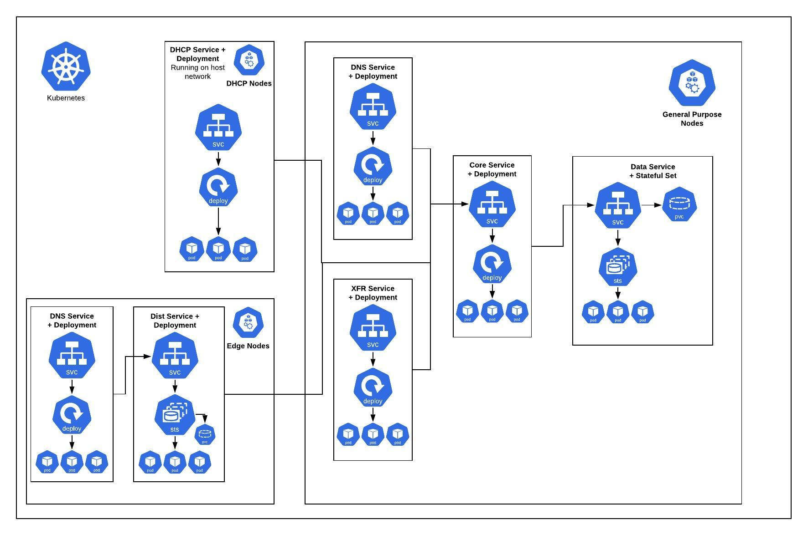

# NS1 Helm Chart

## Prerequisites
- Kubernetes 1.20+ (may work with older versions)
- This chart uses PersistentVolumeClaims and so dynamic PersistentVolume
  provisioning must be configured on the cluster. If you are using a managed
  Kubernetes service then this likely is already done. Regardless, you'll need
  to configure the `data.storage.className` option with the appropriate storage
  class name and similarly for dist if you are running a dist service at an edge
  location.
- NS1 images hosted in an environment that Kubernetes can access and a
  Kubernetes secret with the access credentials.

## Installing the Chart
Create a secret storing Docker credentials if you have not done so already.
See [the Kubernetes documentation](https://kubernetes.io/docs/tasks/configure-pod-container/pull-image-private-registry/#registry-secret-existing-credentials) on how to do this.

Then the chart can be installed:
``` bash
helm install ns1-ddi <path-to-chart> --values=<path-to-values>.yml
```

## Uninstalling the Chart
```
helm uninstall ns1-ddi
```
The PersistentVolumes and PersistentVolumeClaims are not automatically deleted
when the chart is uninstalled and they will need to be manually deleted.

## Configuration

The NS1 infrastructure consists of six services:
- Data
- Core
- DNS
- Dist
- DHCP
- XFR

See [the NS1 help center](https://help.ns1.com/hc/en-us/articles/360024777013-About-core-and-edge-services) for more information about the individual services.

Each service has it's own configuration block, but they share many of the same
configuration options.

Complex network topologies can be achieved by configuring the various services
with combinations of node selections, tolerations, and affinities. See
the [multi-node](examples/multi-node.yml) example and the Kubernetes
documentation on [taints and tolerations](https://kubernetes.io/docs/concepts/configuration/taint-and-toleration/)
and [affinities](https://kubernetes.io/docs/concepts/configuration/assign-pod-node/#node-affinity-beta-feature) for more information.

An example topology could look like this, where:
- Data, core, DNS, and XFR run on general purpose nodes.
- Edge nodes are defined separately to run DHCP, additional DNS pods and Dist.



The following tables lists the configurable parameters of the NS1 DDI chart and example values.

By default, services are disabled. See the examples folder for examples of values.yml files.

### Global

| Parameter | Description | Default |
| --------- | ----------- | ------- |
| `imagePullSecret` | Reference to a secret to be used when pulling images | `ns-docker-creds` |
| `bootstrappable` | Boolean value indicating whether to provide the bootstrap UI for initial installation | `false` |

### Data
| Parameter | Description | Example |
| --------- | ----------- | ------- |
| `data.name` | Name to be used for the various data resources. | `data` |
| `data.replicas` | Number of data replicas to run. This should be 1, 3, or 5. | `3` |
| `data.image.name` | The name of the image to use for the data container. | `ns1inc/privatedns_data` |
| `data.image.tag` | The tag of the image to use for the data container. | `3.2.6` |
| `data.image.pullPolicy` | The pull policy for the image. | `IfNotPresent` |
| `data.livenessProbe.initialDelaySeconds` | How long to wait for the data pods to come up before beginning health checks. | `120` |
| `data.livenessProbe.failureThreshold` | How many failed healthchecks are tolerated prior to restarting the pod. | `5` |
| `data.livenessProbe.periodSeconds` | How often to execute healthchecks. | `15` |
| `data.storage.className` | The type of storage to use for the persistent volume claim that the data service uses. | `default` |
| `data.storage.size` | The size of storage to request per data replica. | `20Gi` |
| `data.popID` | The ID of the PoP. | `default_pop` |
| `data.startupFlags` | Additional flags to pass to the startup command of the data container. | `{}` |
| `data.resources` | CPU/memory resource requests/limits. | `{}` |
| `data.nodeSelector` | Node labels for pod assignment. | `{}` |
| `data.tolerations` | Node tolerations for pod assignment. | `[]` |
| `data.affinity` | Node affinity for pod assignment. | `{}` |

### Core
| Parameter | Description | Example |
| --------- | ----------- | ------- |
| `core.name` | Name to be used for the various core resources. | `core` |
| `core.replicas` | Number of core replicas to run. | `3` |
| `core.image.name` | The name of the image to use for the core container. | `ns1inc/privatedns_core` |
| `core.image.tag` | The tag of the image to use for the core container. | `3.2.6` |
| `core.image.pullPolicy` | The pull policy for the image. | `IfNotPresent` |
| `core.livenessProbe.initialDelaySeconds` | How long to wait for the core pods to come up before beginning health checks. | `30` |
| `core.livenessProbe.failureThreshold` | How many failed healthchecks are tolerated prior to restarting the pod. | `3` |
| `core.livenessProbe.periodSeconds` | How often to execute healthchecks. | `15` |
| `core.popID` | The ID of the PoP. | `default_pop` |
| `core.apiHostname` | The hostname of the NS1 API. | `api.example.com` |
| `core.portalHostname` | The hostname of the NS1 portal. | `portal.example.com` |
| `core.nameServers` | A comma-separated list of nameservers. | `example1.com,example2.com` |
| `core.hostMasterEmail` | An email address for the host master. | `example@email.com` |
| `core.enableOpsMetrics` | Enables operational metrics. | `false` |
| `core.enableWebTLS` | TLS settings for the web UI | `default_web_tls_settings` |
| `core.startupFlags` | Additional flags to pass to the startup command of the core container. | `{}` |
| `core.resources` | CPU/memory resource requests/limits. | `{}` |
| `core.nodeSelector` | Node labels for pod assignment. | `{}` |
| `core.tolerations` | Node tolerations for pod assignment. | `[]` |
| `core.affinity` | Node affinity for pod assignment. | `{}` |

### DNS
| Parameter | Description | Example |
| --------- | ----------- | ------- |
| `dns.image.name` | The name of the image to use for the DNS container. | `ns1inc/privatedns_dns` |
| `dns.image.tag` | The tag of the image to use for the DNS container. | `3.2.6` |
| `dns.image.pullPolicy` | The pull policy for the image. | `IfNotPresent` |
| `dns.pops[#].name` | Name to be used for the various DNS resources. | `dns` |
| `dns.pops[#].replicas` | Number of DNS replicas to run at this PoP. | `3` |
| `dns.pops[#].livenessProbe.initialDelaySeconds` | How long to wait for the DNS pods to come up before beginning health checks. | `30` |
| `dns.pops[#].livenessProbe.failureThreshold` | How many failed healthchecks are tolerated prior to restarting the pod. | `3` |
| `dns.pops[#].livenessProbe.periodSeconds` | How often to execute healthchecks. | `15` |
| `dns.pops[#].popID` | The ID of the PoP. | `default_pop` |
| `dns.pops[#].coreService` | The name of the Kubernetes service for core or for a dist service. | `core` |
| `dns.pops[#].serviceDefID` | The service definition ID(s) that this DNS PoP is responsible for. | |
| `dns.pops[#].operationMode` | DNS operational mode. | `authoritative` |
| `dns.pops[#].enableOpsMetrics` | Enables operational metrics. | `false` |
| `dns.pops[#].startupFlags` | Additional flags to pass to the startup command of the DNS container. | `{}` |
| `dns.pops[#].resources` | CPU/memory resource requests/limits. | `{}` |
| `dns.pops[#].nodeSelector` | Node labels for pod assignment. | `{}` |
| `dns.pops[#].tolerations` | Node tolerations for pod assignment. | `[]` |
| `dns.pops[#].affinity` | Node affinity for pod assignment. | `{}` |

### Dist
| Parameter | Description | Example |
| --------- | ----------- | ------- |
| `dist.image.name` | The name of the image to use for the dist container. | `ns1inc/privatedns_dist` |
| `dist.image.tag` | The tag of the image to use for the dist container. | `3.2.6` |
| `dist.image.pullPolicy` | The pull policy for the image. | `IfNotPresent` |
| `dist.pops[#].name` | Name to be used for the various dist resources. | `dist` |
| `dist.pops[#].replicas` | Number of dist replicas to run at this PoP. | `3` |
| `dist.pops[#].livenessProbe.initialDelaySeconds` | How long to wait for the dist pods to come up before beginning health checks. | `30` |
| `dist.pops[#].livenessProbe.failureThreshold` | How many failed healthchecks are tolerated prior to restarting the pod. | `3` |
| `dist.pops[#].livenessProbe.periodSeconds` | How often to execute healthchecks. | `15` |
| `dist.pops[#].popID` | The ID of the PoP. | `default_pop` |
| `dist.pops[#].coreService` | The name of the Kubernetes service for core. | `core` |
| `dist.pops[#].serviceDefID` | The service definition ID that this dist PoP uses for its config. | `1` |
| `dist.pops[#].dataServiceDefs` | The service definition ID(s) that this dist PoP is subscribed to. | `1,2,3` |
| `dist.pops[#].enableOpsMetrics` | Enables operational metrics. | `false` |
| `dist.pops[#].startupFlags` | Additional flags to pass to the startup command of the dist container. | `{}` |
| `dist.pops[#].resources` | CPU/memory resource requests/limits. | `{}` |
| `dist.pops[#].nodeSelector` | Node labels for pod assignment. | `{}` |
| `dist.pops[#].tolerations` | Node tolerations for pod assignment. | `[]` |
| `dist.pops[#].affinity` | Node affinity for pod assignment. | `{}` |

### DHCP
| Parameter | Description | Example |
| --------- | ----------- | ------- |
| `dhcp.image.name` | The name of the image to use for the DHCP container. | `ns1inc/privatedns_dhcp` |
| `dhcp.image.tag` | The tag of the image to use for the DHCP container. | `3.2.6` |
| `dhcp.image.pullPolicy` | The pull policy for the image. | `IfNotPresent` |
| `dhcp.pops[#].name` | Name to be used for the various DHCP resources. | `dhcp` |
| `dhcp.pops[#].replicas` | Number of DHCP replicas to run at this PoP. | `3` |
| `dhcp.pops[#].livenessProbe.initialDelaySeconds` | How long to wait for the DHCP pods to come up before beginning health checks. | `30` |
| `dhcp.pops[#].livenessProbe.failureThreshold` | How many failed healthchecks are tolerated prior to restarting the pod. | `3` |
| `dhcp.pops[#].livenessProbe.periodSeconds` | How often to execute healthchecks. | `15` |
| `dhcp.pops[#].storage.className` | The type of storage to use for the persistent volume claim that the dhcp service uses. | `default` |
| `dhcp.pops[#].storage.size` | The size of storage to request per dhcp replica. | `10Gi` |
| `dhcp.pops[#].hostMode` | Boolean value indicating whether to run in host mode within Kubernetes. | `false` |
| `dhcp.pops[#].popID` | The ID of the PoP. | `default_pop` |
| `dhcp.pops[#].coreService` | The name of the Kubernetes service for core or dist. | `core` |
| `dhcp.pops[#].serviceDefID` | The service definition ID that this DHCP PoP is responsible for. | `1` |
| `dhcp.pops[#].enableOpsMetrics` | Enables operational metrics. | `false` |
| `dhcp.pops[#].startupFlags` | Additional flags to pass to the startup command of the DHCP container. | `{}` |
| `dhcp.pops[#].resources` | CPU/memory resource requests/limits. | `{}` |
| `dhcp.pops[#].nodeSelector` | Node labels for pod assignment. | `{}` |
| `dhcp.pops[#].tolerations` | Node tolerations for pod assignment. | `[]` |
| `dhcp.pops[#].affinity` | Node affinity for pod assignment. | `{}` |

### XFR
| Parameter | Description | Example |
| --------- | ----------- | ------- |
| `xfr.name` | Name to be used for the various XFR resources. | `xfr` |
| `xfr.replicas` | Number of XFR replicas to run. | `1` |
| `xfr.image.name` | The name of the image to use for the XFR container. | `ns1inc/privatedns_xfr` |
| `xfr.image.tag` | The tag of the image to use for the XFR container. | `3.2.6` |
| `xfr.image.pullPolicy` | The pull policy for the image. | `IfNotPresent` |
| `xfr.livenessProbe.initialDelaySeconds` | How long to wait for the XFR pods to come up before beginning health checks. | `30` |
| `xfr.livenessProbe.failureThreshold` | How many failed healthchecks are tolerated prior to restarting the pod. | `3` |
| `xfr.livenessProbe.periodSeconds` | How often to execute healthchecks. | `15` |
| `xfr.popID` | The ID of the PoP. | `default_pop` |
| `xfr.coreService` | The name of the Kubernetes service for core. | `core` |
| `xfr.enableOpsMetrics` | Enables operational metrics. | `false` |
| `xfr.startupFlags` | Additional flags to pass to the startup command of the XFR container. | `{}` |
| `xfr.resources` | CPU/memory resource requests/limits. | `{}` |
| `xfr.nodeSelector` | Node labels for pod assignment. | `{}` |
| `xfr.tolerations` | Node tolerations for pod assignment. | `[]` |
| `xfr.affinity` | Node affinity for pod assignment. | `{}` |

Specify each parameter using the `--set key=value[,key=value]` argument to `helm install`.

Alternatively, a YAML file that specifies the values for the above parameters can be provided while installing the chart. For example,

```bash
helm install ns1-ddi -f values.yml .
```
